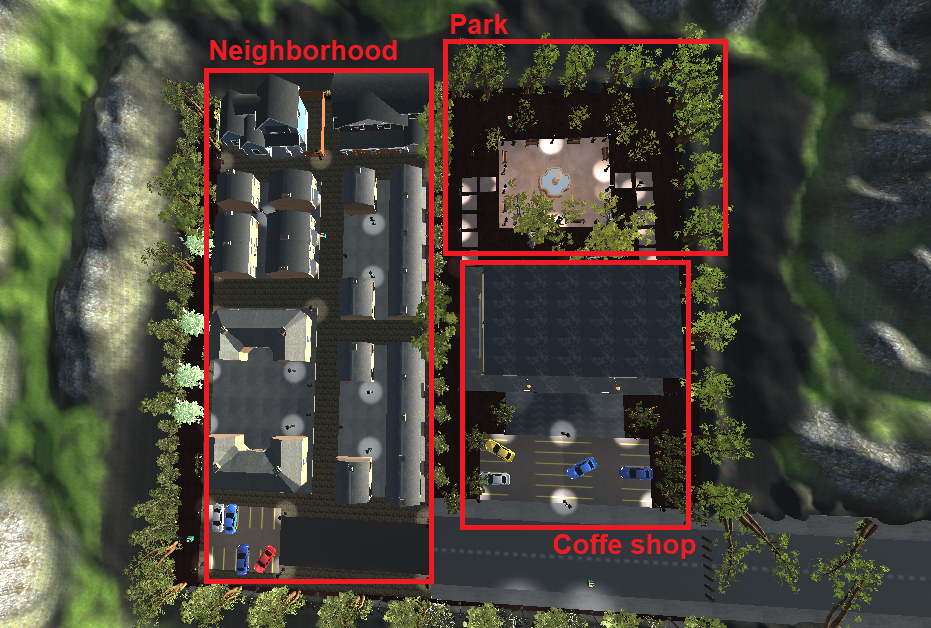

# ShootingGame

Final project in a game development course.  
A shooting game between two groups that takes place in an outdoor area that has a neighborhood, coffe shop, park and hiding places, surrounded by mountains. 

## Game description:
The game starts with the player, and npcs, trying to find a weapon which appears in random places each time. 
When one of the squads receives the weapons, they start chasing the others. 
The human player receives text messages on the screen about it. 
When one of the players is injured or killed and also when the squad wins or loses, an appropriate message will appear. 

## Game created with:
* Unity version: 2020.3.13f1 
